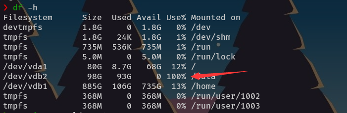

---

slug: mysql-error

title: Mysql假死现象

authors: pincman

tags: [mysql, mariadb,linux]

rf_summary: 在打开PHP站点的时候总是遇到Mysql/Maridb卡死的现象，每次都要重启搞的很不爽，经过一番搜索和操作终于解决了这个毒瘤

---
import Tabs from '@theme/Tabs';
import TabItem from '@theme/TabItem';

# 记一次Mysql(Mariadb)卡死的情况

<Tabs groupId="non-mac-operating-systems" lazy>
  <TabItem value="win" label="Windows">Windows is windows.</TabItem>
  <TabItem value="unix" label="Unix">Unix is unix.</TabItem>
</Tabs>

:::tip

<div className="impression"> 其实很多问题只需要耐心的谷歌基本都可以解决 </div>

:::

## 起因

:::note

Some **content** with _markdown_ `syntax`. Check [this `api`](#).

:::

:::tip

Some **content** with _markdown_ `syntax`. Check [this `api`](#).

:::

:::info

Some **content** with _markdown_ `syntax`. Check [this `api`](#).

:::

:::caution

Some **content** with _markdown_ `syntax`. Check [this `api`](#).

:::

:::danger

Some **content** with _markdown_ `syntax`. Check [this `api`](#).

:::

最近发现使用PHP架设的几个站点和应用一直出现打不开假死的现象，而使用同一台服务器的静态应用完全OK。重启过后一切正常，过段时间又是这样。

## 过程

静态站点能打开就证明应该不是nginx的问题，在加上服务器上运行着内存老虎-nextcloud，所以理所当然的以为问题出在php-fpm上。因为服务器架设的是多版本的php(php7.4和php8.1)，但是php8的站点还是能打开，只不过有点卡，而php7的则直接卡死，这又让我走了一下弯路，以为问题是出在php-fpm74身上，然后自然而然的调整php7的php.ini，php-fpm.conf里面的参数，并在 `service php74-fpm restart` 之后问题依旧。

接着打开php74-fpm的日志进行查看，并没发现异常。这时候nginx和php-fpm的问题基本已经排除了，因为是wordpress站点，所以并没有Redis，RabbitMQ这些其余中间件的问题，所以瞬间意识到问题一定是出现在了Mysql身上。

尝试`service restart mysqld`，发现没有反应，卡在那边，这是庆幸问题终于找到了。但是该怎么处理呢？第一步当然是查看日志，因为服务器用的是Mariadb，并且为了利用外挂磁盘，所以数据目录放在挂载额外磁盘的`/data`目录，cat一下`/data/mariadb/mysql-error.log`，真的找到了错误，出现了这么一条日志

```shell
[ERROR] mariadbd: Error writing file 'mysql-bin' (errno: 28 "No space left on device")
```

开始利用宇宙第一神器[google.com](https://google.com)进行搜索，发现在[stackoverflow](https://stackoverflow.com/)上遇到此类问题的人还挺多，其中一个回答说的是数据目录挂载的磁盘容量被占满，一句话被点醒。

使用`df -h`命令查看磁盘占用，如下图，其



打开`/data`目录，使用`du -sh *`命令查看文件的占用，发现了满屏以`mysql-bin.`开头的文件，并且每个文件占用大概1G多，这些文件一般来说是用来进行主从复制时使用的，然后我一单服务器给我生成这么一大堆，磁盘怎么可能不被沾满。。。

## 解决

解决方法很简单，只要`rm -rf  mysql-bin.*`清空这些文件，然后编辑`/etc/my.cnf`，注释掉以下两项，关闭自动生成就行

```shell
#log_bin = mysql-bin
#binlog_format = mixed
```

最后重启Mysql/Mariadb就行，现在试试`service mysqld restart`，不再卡主，站点也能正常运行